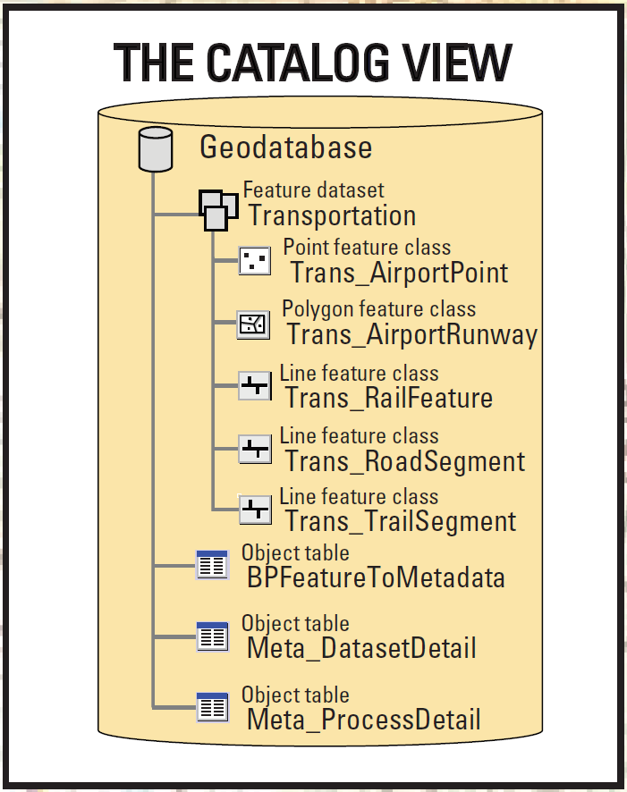
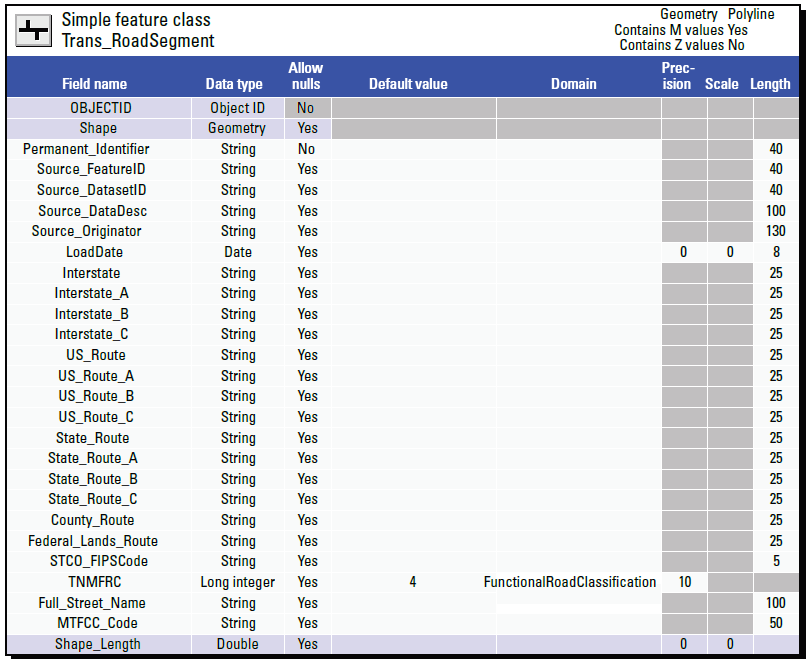
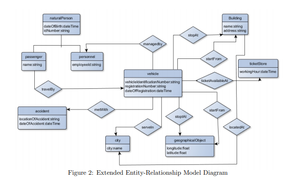
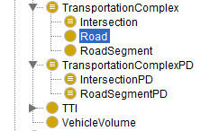

# FSDF Roads

This repository holds definitions associated with **Roads** as part of the [FSDF Transport theme](https://www.anzlic.gov.au/resources/foundation-spatial-data-framework/fsdf-themes-datasets/transport).

## Prior art

Most prior work has conceptualized Roads as a special case of a generalized Transportation network, alongside Railways, Air and Water transportation networks. 
In turn the Transportation network builds on a general network topological model, composed of nodes and segmenets or links. 

### USGS National Transportation Dataset

[Website](https://www.usgs.gov/media/files/national-transportation-dataset-ntd-data-model-poster-v212), [Poster](https://prd-wret.s3.us-west-2.amazonaws.com/assets/palladium/production/atoms/files/TNM_DataModel_Transportation_v2-1-2__040220.pdf)

 

### INSPIRE Transport Networks

Generic Network model

- [UML Model](https://inspire.ec.europa.eu/data-model/approved/r4618-ir/html/index.htm?goto=2:1:9:6:7586)

- [XML Schema](https://inspire.ec.europa.eu/schemas/net/4.0/Network.xsd)

[Data specification for Transport Networks](https://inspire.ec.europa.eu/Themes/115/2892)
- [Technical Guideline](https://inspire.ec.europa.eu/id/document/tg/tn)
- [UML Model](https://inspire.ec.europa.eu/data-model/approved/r4618-ir/html/index.htm?goto=2:1:9:7:7627)

- [XML Schema](https://inspire.ec.europa.eu/schemas/tn-ro/4.0/RoadTransportNetwork.xsd)
- [RDF Vocabulary](https://github.com/inspire-eu-rdf/inspire-rdf-vocabularies/tree/master/tn) encoded from UML using ISO 19150-2 rule

Geographical Name

- [UML Model](https://inspire.ec.europa.eu/data-model/approved/r4618-ir/html/index.htm?goto=2:1:6:2:7240)
- [XML Schema](https://inspire.ec.europa.eu/schemas/gn/4.0/GeographicalNames.xsd)

### An Ontology for Transportation System (2019)

https://easychair.org/publications/open/8Fls 
- 

### A Transportation Ontology for Global City Indicators (ISO 37120)

Part of [EIL ontologies](http://ontology.eil.utoronto.ca/) for Global City Indicators. 
- [Transportation Ontology](http://ontology.eil.utoronto.ca/GCI/Transportation/GCI-Transportation.owl) in OWL/RDF format
- 

### Ontology of Transportation Networks (2005)

https://www.semanticscholar.org/paper/Ontology-of-Transportation-Networks-Lorenz/636d7965284612377e571ee7d3b3b256aec03fd8

- Derived from GDF
